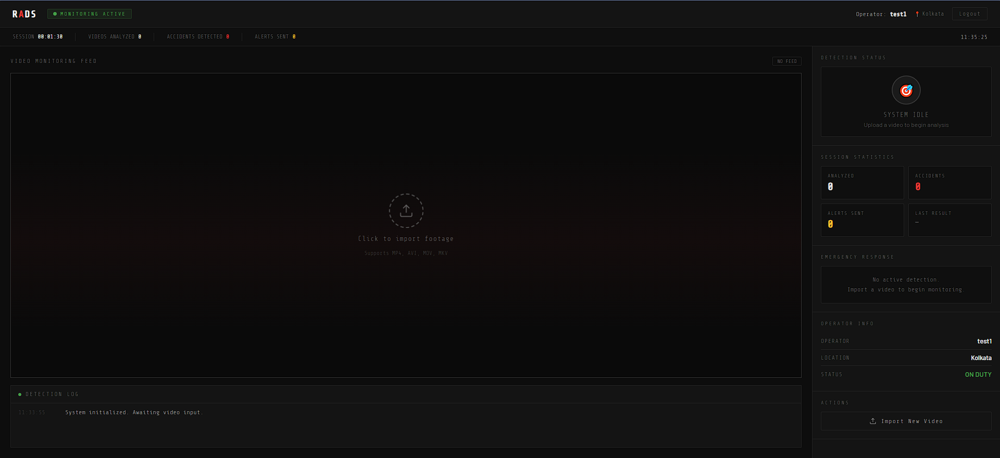
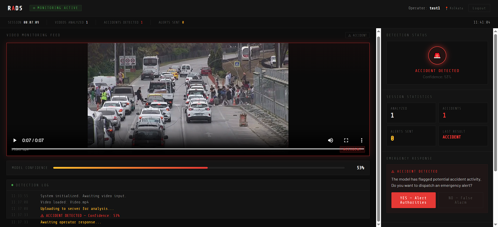

# 🚨 RADS - Roadside Accident Detection System

[](https://www.python.org/downloads/)
[](https://github.com/ultralytics/ultralytics)
[](https://www.php.net/)
[](LICENSE)

**AI-Powered Real-Time Accident Detection using YOLOv8 with Automated SMS Alerting**

RADS is an end-to-end accident detection system that combines deep learning (YOLOv8n), multi-rule analysis, and a web-based monitoring platform to automatically detect traffic accidents from video footage and instantly alert authorities via SMS.

---

## ✨ Features

### 🎯 Core Capabilities
- **YOLOv8n Fine-Tuning**: Custom-trained model on 6,424 annotated frames (4 vehicle classes: car, bike, bus, truck)
- **5-Rule Accident Detection System**: Multi-heuristic approach combining velocity drop, IoU overlap, area change, abnormal stop, and trajectory deviation
- **Web Dashboard**: Real-time monitoring interface for operators with video upload and analysis
- **Automated SMS Alerts**: Fast2SMS integration for instant emergency notifications
- **Confidence Scoring**: 65% threshold with temporal smoothing to minimize false positives

### 🛡️ Optimizations
- **Processing Speed**: 3 fps sampling with model fusion (40-50% faster than baseline)
- **False Positive Reduction**: Strict thresholds, 4-frame temporal persistence, 3+ multi-rule triggering requirement
- **Temporal Smoothing**: Sustained event detection over multiple frames

---

## 🏗️ System Architecture

```
┌─────────────────────────────────────────────────────────────┐
│                    PRESENTATION LAYER                        │
│         (HTML/CSS/JS Dashboard - User Interface)             │
└──────────────────────┬──────────────────────────────────────┘
                       │
┌──────────────────────▼──────────────────────────────────────┐
│                   APPLICATION LAYER                          │
│     (PHP Backend - Auth, Upload, Analysis Trigger)           │
└──────────────────────┬──────────────────────────────────────┘
                       │
┌──────────────────────▼──────────────────────────────────────┐
│                 AI DETECTION ENGINE                          │
│  (Python + YOLOv8n + 5-Rule System + BoT-SORT Tracker)       │
└──────────────────────┬──────────────────────────────────────┘
                       │
┌──────────────────────▼──────────────────────────────────────┐
│                      DATA LAYER                              │
│   (MySQL - operators, detection_logs, alert_logs)            │
└─────────────────────────────────────────────────────────────┘
                       │
┌──────────────────────▼──────────────────────────────────────┐
│                  EXTERNAL SERVICES                           │
│              (Fast2SMS API - SMS Gateway)                    │
└─────────────────────────────────────────────────────────────┘
```

---

## 🎬 Demo

### Dashboard Interface


### Detection Result


### SMS Alert Sample
```
ACCIDENT ALERT! Location: Kolkata EM Bypass Near Ruby Hospital. 
Operator: Rajesh Kumar. Confidence: 87%. Respond immediately.
```

---

## 📖 Usage

### Starting the System

1. **Start XAMPP Services**
   - Open XAMPP Control Panel
   - Start Apache and MySQL

2. **Access the Dashboard**
   ```
   http://localhost/RADS/roadside_accident_website/
   ```
   
3. **Register an Operator Account**
   - Click "Register"
   - Fill in details (location will be embedded in SMS alerts)
   - Login with credentials

4. **Upload & Analyze Video**
   - Click "Import New Video" or drag video to upload area
   - Supported formats: MP4, AVI, MOV, MKV
   - Wait for analysis (typically 20-30 seconds for 30-second video)

5. **Handle Detections**
   - If accident detected: "YES — Alert Authorities" to send SMS
   - If false positive: "NO — False Alarm" to dismiss

---

## 🧠 How It Works

### 1. Vehicle Detection
- **YOLOv8n** detects vehicles in each frame
- **BoT-SORT tracker** assigns consistent IDs across frames
- Processes at **3 fps** for optimal speed/accuracy balance

### 2. 5-Rule Accident Detection

Each rule independently evaluates accident likelihood:

| Rule | Description | Weight | Threshold |
|------|-------------|--------|-----------|
| **Velocity Drop** | Speed drops below 60% of rolling average | 35% | 60% deceleration |
| **IoU Overlap** | Bounding box overlap >0.18 for 3 frames | 30% | 0.18 IoU |
| **Area Change** | Box area changes >50% for 3 frames | 10% | 50% change |
| **Abnormal Stop** | Fast (>25 px/frame) → Stopped (<2.5 px/frame) | 20% | Within 8 frames |
| **Trajectory Deviation** | Direction change >125° | 5% | 125° angle |

### 3. Confidence Calculation

```python
frame_score = weighted_sum(rule_scores)

# Multi-rule bonus: 20% boost if 3+ rules fire simultaneously
if num_rules_triggered >= 3:
    frame_score *= 1.20

# Temporal smoothing: Only count sustained peaks >0.35 for 4+ frames
final_confidence = 0.65 * sustained_peak + 0.35 * mean_high_frames

# Classification
accident = (final_confidence >= 0.65)
```

### 4. Alert Workflow

```
Accident Detected → Operator Confirmation → SMS via Fast2SMS → Database Log
```

---

## ⚙️ Configuration

### Detection Parameters

Edit `roadside_accident_website/detect.py`:

```python
# Confidence thresholds
CONF_THRESHOLD = 0.35          # YOLO detection confidence
ACCIDENT_THRESHOLD = 0.65       # Final accident classification

# Rule thresholds
DECEL_RATIO_THRESH = 0.60      # Velocity drop ratio
IOU_THRESH = 0.18              # Bounding box overlap
AREA_CHANGE_THRESH = 0.50      # Area change percentage

# Temporal parameters
TEMPORAL_PERSIST = 4           # Frames to sustain event
IOU_MIN_FRAMES = 3             # IoU persistence frames
```

### SMS Message Format

Edit `roadside_accident_website/php/send_alert.php`:

```php
$message = "ACCIDENT ALERT! Location: {$location}. "
         . "Operator: {$operator}. Confidence: {$confidence}%. "
         . "Respond immediately.";
```

---

## 📊 Results

### Training Performance

| Metric | Value |
|--------|-------|
| **mAP50** | 81.2% |
| **Precision** | 73.0% |
| **Recall** | 73.0% |
| **Training Epochs** | 50 (early stopping) |
| **Dataset Size** | 6,424 train + 1,606 val images |

### Class-wise Performance

| Class | Precision | Recall | mAP50 |
|-------|-----------|--------|-------|
| Car | 0.78 | 0.74 | 0.83 |
| Motorbike | 0.69 | 0.70 | 0.78 |
| Bus | 0.74 | 0.72 | 0.81 |
| Truck | 0.71 | 0.73 | 0.82 |

### Processing Speed

- **30-second video**: ~20-30 seconds processing time
- **Sampling rate**: 3 fps (90 frames from 30s video)
- **GPU**: NVIDIA GTX 1660 Super (6GB VRAM)

---

## 📁 Project Structure

```
RADS/
├── roadside_accident_website/           # Main web application
│   ├── php/
│   │   ├── register.php                 # User registration
│   │   ├── login.php                    # Authentication
│   │   ├── analyze.php                  # Python script caller
│   │   └── send_alert.php               # SMS dispatch
│   ├── model/
│   │   └── best.pt                      # YOLOv8 trained weights
│   ├── detect.py                        # Accident detection script
│   ├── dashboard.php                    # Operator interface
│   ├── database_setup.sql               # MySQL schema
│   └── index.html                       # Landing page
│
├── training/
│   ├── train.py                         # YOLOv8 training script
│   ├── data.yaml                        # Dataset configuration
│   └── datasets/
│       ├── train/                       # Training images
│       └── val/                         # Validation images
│
├── docs/
│   ├── RADS_Project_Report.pdf          # Full project report
│   ├── RADS_Presentation.pdf            # Project presentation
│   └── images/                          # Documentation images
│
├── requirements.txt                     # Python dependencies
├── README.md                            # This file
└── LICENSE                              # MIT License
```

---

## 🛠️ Technologies Used

### AI/ML Stack
- **YOLOv8n** (Ultralytics) - Object detection
- **PyTorch 2.7.1** - Deep learning framework
- **OpenCV** - Video processing
- **NumPy** - Numerical computing
- **BoT-SORT** - Multi-object tracking

### Web Stack
- **PHP 8.0+** - Backend logic
- **MySQL** - Database
- **HTML5/CSS3/JavaScript** - Frontend
- **XAMPP** - Local development server

### External Services
- **Fast2SMS** - SMS gateway API

### Development Tools
- **Python 3.8+**
- **CUDA 12.4** - GPU acceleration
- **Git** - Version control

---

## 🔮 Future Enhancements

### Planned Features

1. **Live RTSP Stream Integration**
   - Real-time processing of CCTV feeds instead of uploaded videos
   - WebRTC support for browser-based streaming

2. **Dedicated Accident Classifier**
   - Binary CNN model trained specifically on accident clips
   - Improved accuracy over rule-based approach

3. **Multi-Camera Dashboard**
   - Simultaneous monitoring of multiple locations
   - Unified alert panel with priority queue

4. **Severity Classification**
   - Classify accidents as minor/moderate/critical
   - Prioritize response based on severity

5. **Edge Deployment**
   - Deploy on NVIDIA Jetson for on-site processing
   - Reduce latency and bandwidth requirements

6. **Mobile App**
   - iOS/Android app for operators
   - Push notifications instead of SMS

---

## 📄 License

This project is licensed under the **MIT License** - see the [LICENSE](LICENSE) file for details.

---

## 🙏 Acknowledgments

- **Ultralytics** for the YOLOv8 framework
- **Fast2SMS** for SMS API services
- **OpenCV** community for computer vision tools
- Academic supervisors and reviewers for guidance

---

## 📞 Contact

**Project Maintainers**:

* Arnab Majhi
* Bodhiswatwa Chowdhury

**Organization**: https://github.com/RADS-Tech

**GitHub Profiles**:

* https://github.com/ArnabARDJ
* https://github.com/DecodeTatai

**Project Link**:
https://github.com/RADS-Tech/RADS

---

## 📈 Project Status

**Current Version**: 1.0.0  
**Status**: ✅ Stable Release  
**Last Updated**: March 2026

### Roadmap

- [x] YOLOv8 fine-tuning
- [x] 5-rule detection system
- [x] Web dashboard
- [x] SMS alerting
- [x] Performance optimization
- [ ] Live RTSP streaming
- [ ] Mobile app
- [ ] Severity classification
- [ ] Edge deployment

---

<div align="center">

**If you find this project helpful, please consider giving it a ⭐ on GitHub!**

Made with ❤️ for safer roads

</div>

